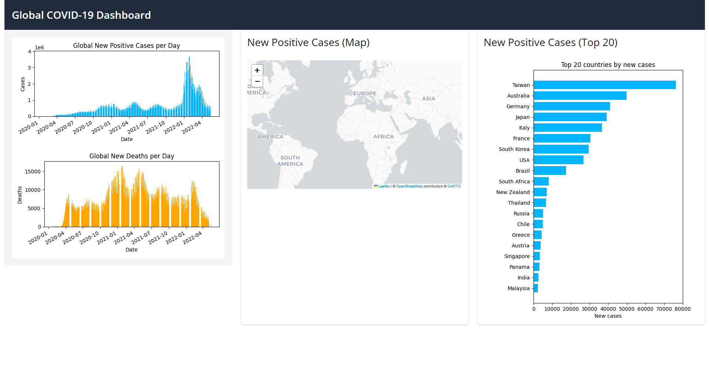

# Useful Code-Snippets
```py
folium.Circle(
            location=[10, 10],
            radius=50000,  # meters
            color='red',
            fill=True,
            fill_color='red',
            fill_opacity=0.4,
            popup='Country Name: new cases …'
        ).add_to(m)
```

```py

```

# TODO
- Restyle the map
- learn about using the map -> Testfile
- Create the bubles in the map
- Redo the plots with plotly
- 
- Add Filters and interactive


---
# Report


https://raw.githubusercontent.com/google/dspl/master/samples/google/canonical/countries.csv